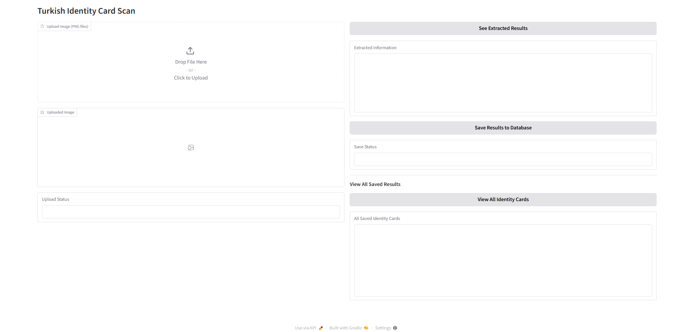

# identity-scan
 OCR Turkish Identity Card Scanner using FastAPI and Gradio

 
## Demo Video

[](https://www.youtube.com/watch?v=DpsFDZcUw4s)

## What This App Does

This app is designed to provide an end-to-end pipeline for extracting identity information from uploaded identity card images. It offers a user-friendly interface through Gradio, allowing you to:

- 📤 Upload an identity card image
- 🧠 Use a YOLO model to detect key fields (e.g., ID number, name, surname, birth date)
- 🔍 Use EasyOCR to extract text from those detected fields
- 💾 Save the extracted information into an SQLite database for future use

### Purpose

The main goal of this project is to streamline the process of identity data extraction by combining:

- **YOLO** for object detection to locate fields on the card
- **EasyOCR** for accurate text extraction
- **Gradio** for an interactive and accessible user interface
- **SQLite** for lightweight, local data storage

This setup enables fast and efficient data extraction and management without relying on external APIs or manual input.


## Project Structure

This project is organized into several key directories and files to manage the application logic, data generation, and machine learning components.
```plaintext

├── app/                                 # Core application logic (FastAPI, Gradio)
│   ├── crud.py                          # Database CRUD operations
│   ├── database.py                      # Database connection and setup
│   ├── gradio_ui.py                     # Gradio Blocks UI definitions
│   ├── inference.py                     # Model inference logic
│   ├── schemas.py                       # Data schemas and validation
│   ├── main.py                          # FastAPI app and Gradio mounting
│   └── models.py                        # Database models
├── fake_data_generation/                # Scripts and utils for generating synthetic data
│   ├── bbox_utils.py                    # Bounding box calculations
│   ├── faker_utils.py                   # Faker library utilities for data generation
│   ├── generate_sample.py               # Main script for synthetic data generation
│   ├── image_utils.py                   # Image manipulation utilities
│   ├── text_utils.py                    # Text rendering on images
│   ├── txt_utils.py                     # Handling text files
│   ├── template.jpg                     # Template image for identity card
│   └── Arial.ttf                        # Font used for text rendering
├── fake_generated_data/                 # Folder where generated data is saved
│   ├── images/                          # Dataset images for training/validation
│   │   ├── train/                       # Training images
│   │   └── val/                         # Validation images
│   └── labels/                          # YOLO format labels corresponding to images
│       ├── train/                       # Training labels
│       └── val/                         # Validation labels
├── classes.txt                          # Object classes for YOLO training
├── requirements.txt                     # Python dependencies
└── sample.png                           # Example output image or sample
```
---

### Explanation of Key Components

* **`app/`**: This directory contains the **backend API and user interface**. It's built with FastAPI for the API endpoints and Gradio for a user-friendly interface. Each file within details a specific aspect, from database operations (`crud.py`, `database.py`, `models.py`) to API schema definitions (`schemas.py`) and model inference (`inference.py`).
  
* **`fake_data_generation/`**: This section is dedicated to **creating synthetic identity card data**. The `generate_sample.py` script is the core, utilizing various utility files (`bbox_utils.py`, `faker_utils.py`, `image_utils.py`, `text_utils.py`, `txt_utils.py`) to create realistic-looking images and their corresponding YOLO labels based on a `template.jpg` and `Arial.ttf` font
  
* **`fake_generated_data/`**: This folder acts as the **storage for the synthetic data** produced by the `fake_data_generation` scripts. It's pre-structured with `images/` and `labels/` subdirectories, each containing `train/` and `val/` splits, making it ready for direct use in YOLO model training.
  
* **`classes.txt`**: This file is crucial for **YOLO model training**, defining the different object classes that the model will learn to detect (e.g., "name," "date of birth").
  
* **`requirements.txt`**: Lists all the **Python libraries and their versions** needed to run the project. This ensures environment consistency and easy setup.
  
* **`sample.png`**: Provides a **visual example** of the project's output, giving a quick overview of what to expect.
---

## Synthetic Data Generation

Initially, synthetic identity card images and labels were created manually using `template.jpg` and the Faker library. Roughly 10 examples were labeled with LabelImg, but this method proved too time-consuming.

To automate this process, scripts have been developed and are located in the `fake_data_generation/` folder.


### How to Generate Synthetic Data

1. Run the following script to generate synthetic identity card images and their corresponding YOLO labels:

    ```bash
    python fake_data_generation/generate_sample.py
    ```
2.  This will create a `synthetic_data/` folder inside `fake_data_generation/`, containing:

    * `images/`: synthetic identity card images
    * `labels/`: YOLO-format label text files
    
    **Note:** You can modify the number of generated samples by adjusting the `range` parameters within the script.


### Organizing Generated Data

1.  Open `fake_generated_data/` folder in the project root. Inside, open the `images/` and `labels/` folders. Both of these should contain `train/` and `val/` subfolders.
2.   Manually cut and paste the generated images and label files from `fake_data_generation/synthetic_data/` into the appropriate `train/` and `val/` folders under `fake_generated_data/`.
3. This dataset structure is now ready for training your YOLO model.


    **Note:**  If you prefer not to run the generation script yourself, a sample dataset is already available in the `fake_generated_data/` folder of this repository. You can use it directly for training or  testing.

---

## 🚀 How It Works

Follow the steps below to set up and run the application:

1. **Create a virtual environment**  

   Create and activate a virtual environment (optional but recommended):

   ```bash
   python -m venv venv
   source venv/bin/activate  # On Windows use: venv\Scripts\activate

2. **Install dependencies**

   Install required packages from requirements.txt:
   
   ```bash
   pip install -r requirements.txt
   ```
3. **Generate and Organize Data (if not using provided dataset)**

   If you are not using the pre-provided dataset in fake_generated_data/, follow the instructions in the "Synthetic Data Generation Process" section above to generate and organize your own data.

4. **Start the application**

   Run the app using Uvicorn:
    
    ```bash
    uvicorn main:app --reload
    ```
5. **Open the Gradio UI**

   Navigate to the following URL in your browser:

    ```bash
    http://127.0.0.1:8000/gradio/
    ```
